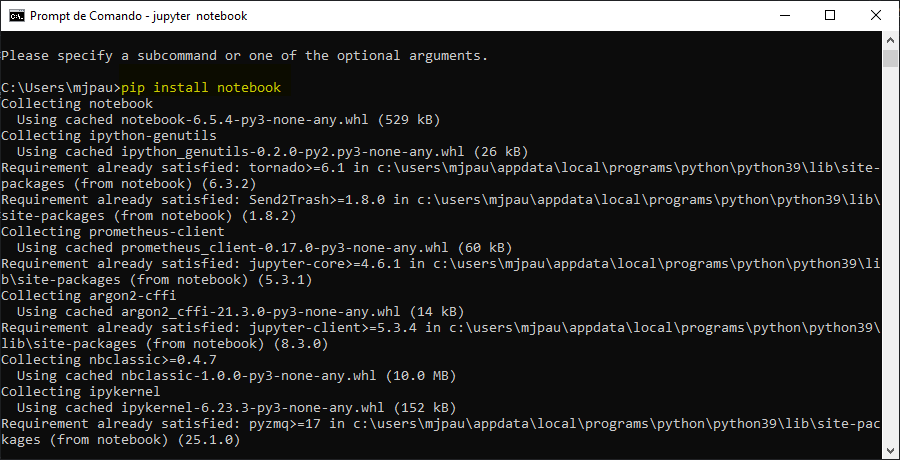

# Inteligência Artificial

## Como rodar o Jupyter no Windows

Resumo de como instalar e rodar o Jupyter Notebook no Windows por meio pro Prompt de Comando.

### 1. [Instale Python](https://www.python.org/)

### 2. Instale o PIP

O PIP é o gerenciador de pacotes do Python. Saiba mais como instala-lo no [link da Neps Academy](https://neps.academy/br/blog/como-instalar-pip:-o-gerenciador-de-pacotes-do-python-no-windows).

### 2. Instale o Jupyter e o Notebook.

No prompt de comando no Windows (cmd), digite os seguintes comandos:

`pip install jupyter` e 
`pip install notebook`

### 3. `jupyter notebook`

Feita a instalação, digite no promt de comando  `jupyter notebook`. Em seguida, siga as instruções do comando, abrindo o arquivo que ele orienta ou copiando e colando no navegador o link indicado.
